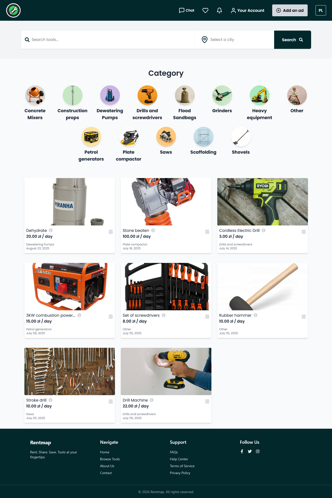
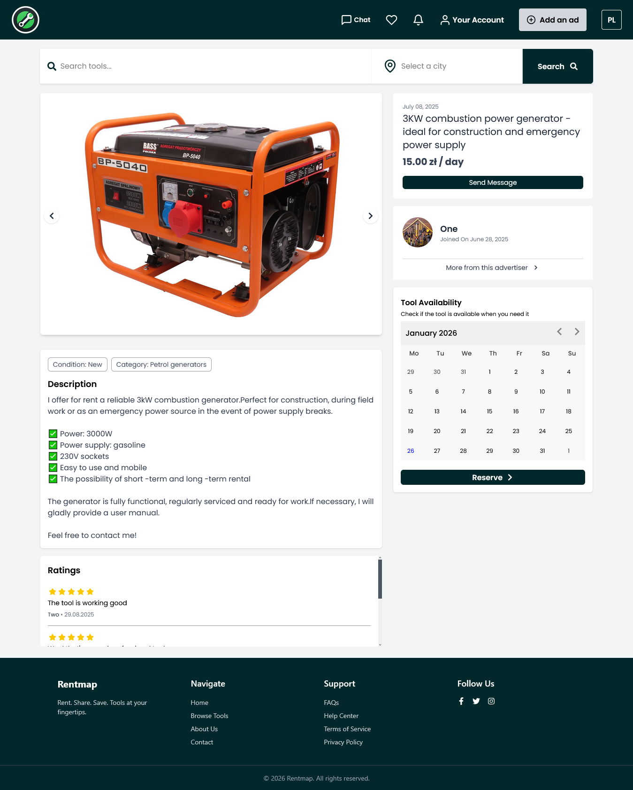
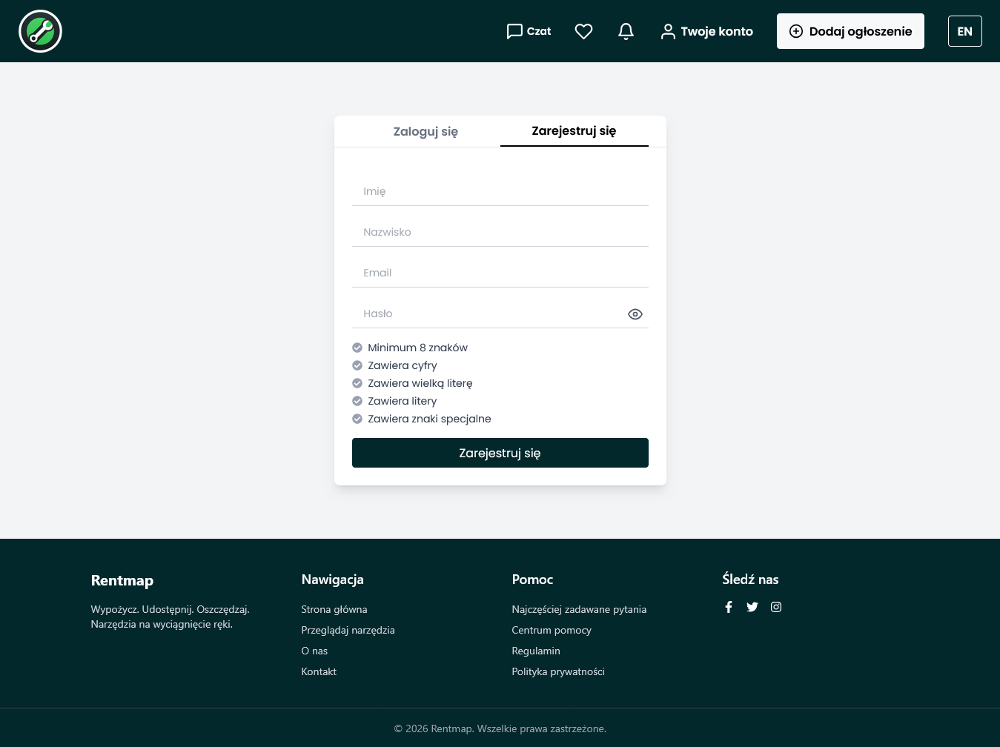
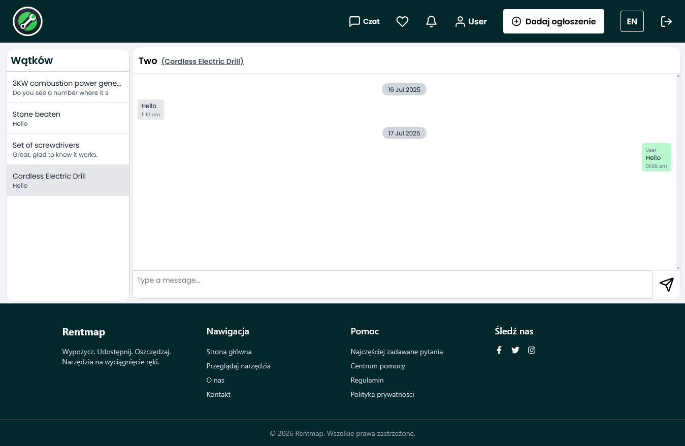
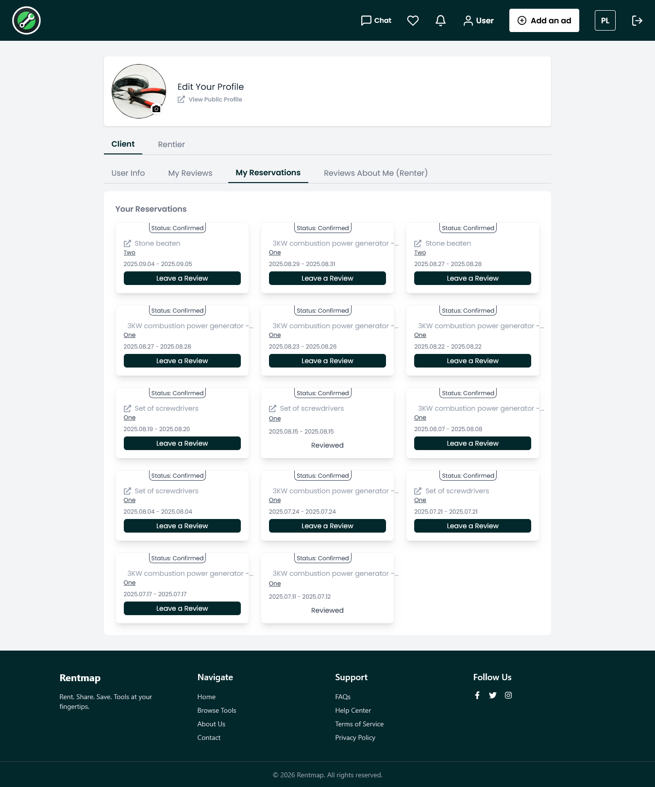

# RentMap — Multi-Vendor Equipment Rental Marketplace

RentMap is a full-stack PropTech MVP built to support equipment and tool rentals across multiple vendors and categories.

The platform includes listing management, reservations, bilingual support, user messaging, reviews, geospatial search, and responsive dashboards.

> ⚠️ Source code is private and owned by the client.  
> This repository exists solely for portfolio and showcase purposes.

---

## Features

### Marketplace System

- Multi-vendor equipment listings
- Category-based browsing
- Search & location filtering
- Booking & reservation workflows
- Review and rating system

### Communication System

- Persistent user conversations
- Polling-based messaging workflow
- Notifications and unread indicators

### Internationalization

- Bilingual interface support
- Automatic translation for user-generated listings

### User Experience

- Fully responsive UI
- Mobile-friendly layouts
- 20+ production-ready screens
- Optimized frontend state management

---

## Tech Stack

### Frontend

- React.js
- TypeScript
- TailwindCSS

### Backend

- Django
- Django REST Framework

### Database

- PostgreSQL

### Deployment

- Vercel
- Render

---

## Screenshots

### Homepage

### Listing

### Authentication

### Messaging System

### User Profile

---

## My Contributions

As the primary full stack developer, I worked across both frontend and backend systems including:

- Backend architecture and database schema design
- Secure REST API development
- Frontend implementation using React + TypeScript
- Chat and notification systems
- Search and geospatial filtering
- Deployment and production configuration
- Responsive UI implementation
- Translation workflows

---

## Technical Highlights

- Designed scalable relational data models
- Built REST APIs for listings, reservations, reviews, and messaging
- Implemented optimized filtering workflows
- Structured reusable frontend components using TypeScript
- Integrated bilingual support into listing workflows

---

## Project Status

RentMap is currently in active MVP development.

The public repository currently serves as a project showcase and technical overview while the production codebase remains private.

> Note: The live platform may occasionally be unavailable due to ongoing maintenance and active development.

---

## Author

### Shafaq Sarfraz

Full Stack Developer

- GitHub: https://github.com/ssar921
